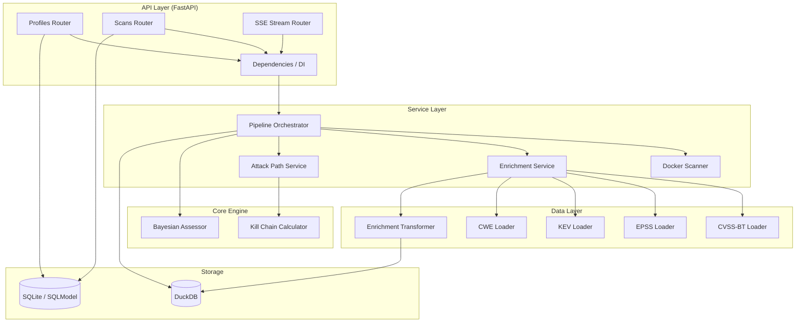
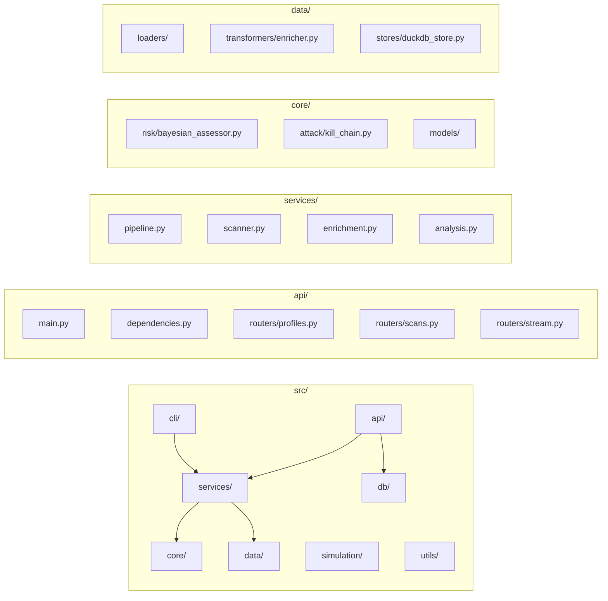
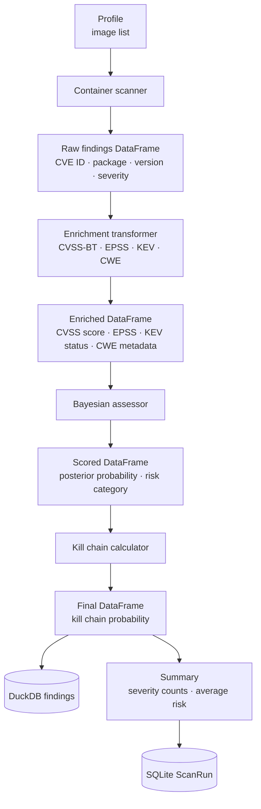

# CVEs Analytics — Application Guide

Vulnerability analytics platform that scans container images, enriches findings with threat intelligence, computes Bayesian risk scores, and models attack paths through the cyber kill chain.

## Table of Contents

1. [What It Does](#what-it-does)
2. [Architecture](#architecture)
3. [Module Map](#module-map)
4. [Data Flow](#data-flow)
5. [Pipeline Steps](#pipeline-steps)
6. [Running the Application](#running-the-application)
7. [Configuration](#configuration)
8. [Storage](#storage)
9. [Testing](#testing)

---

## What It Does

Given a set of Docker images, CVEs Analytics:

1. **Scans** each image for known CVEs (Grype/Trivy)
2. **Enriches** raw findings with CVSS-BT scores, EPSS exploitation probabilities, KEV catalog status, and CWE metadata
3. **Scores** each vulnerability with a Bayesian risk posterior that fuses CVSS, EPSS, security controls, and threat intelligence
4. **Models** attack paths through the kill chain (initial access → execution → lateral movement → objective)
5. **Stores** results in DuckDB (analytics) and SQLite (metadata) for querying and reporting

The output is a ranked list of vulnerabilities with posterior risk scores, credible intervals, risk categories, and kill-chain attack-path probabilities.

---

## Architecture



---

## Module Map



### Module Responsibilities

| Module | Files | Responsibility |
|--------|-------|---------------|
| **api/** | `main.py`, `dependencies.py`, `routers/` | FastAPI app, REST endpoints, SSE streaming, DI |
| **cli/** | `pipeline.py` | CLI entry point (`uv run cves-analytics`) |
| **core/models/** | `__init__.py` | Data contracts: `SecurityControlsInput`, `ThreatIndicatorsInput`, `BayesianRiskResult`, `KillChainResult` |
| **core/risk/** | `bayesian_assessor.py` | Bayesian posterior computation with likelihood ratios |
| **core/attack/** | `kill_chain.py` | Kill-chain stage probability calculation |
| **data/loaders/** | `cvss_bt.py`, `epss.py`, `kev.py`, `cwe.py` | Download, cache, and load reference datasets |
| **data/transformers/** | `enricher.py` | Left-join enrichment of scan results with reference data |
| **data/stores/** | `duckdb_store.py` | DuckDB OLAP store for findings |
| **db/** | `sqlite_models.py` | SQLModel ORM: `Profile`, `ScanRun`, `Job` tables |
| **services/** | `pipeline.py`, `scanner.py`, `enrichment.py`, `analysis.py` | Business logic orchestration |
| **utils/** | `config.py`, `logging_config.py` | Settings (pydantic-settings), structured logging |

### Dependency Directions

```
api → services → core, data → storage
api → db (SQLite ORM)
cli → services
```

No circular dependencies. Core engine has zero external dependencies beyond polars and standard library.

---

## Data Flow



### Column Evolution

| Step | Columns Added |
|------|--------------|
| **Scan** | `cve_id`, `package`, `version`, `image`, `severity` |
| **CVSS-BT enrich** | `cvss_base_score`, `cvss_bt_score`, `cvss_base_vector`, `epss`, `cwe_id` |
| **EPSS enrich** | `epss` (if not in CVSS-BT) |
| **KEV enrich** | `is_kev_from_catalog` |
| **CWE enrich** | `cwe_name`, `cwe_desc`, `cwe_cc_scope`, `cwe_cc_impact` |
| **Bayesian risk** | `posterior_probability`, `risk_category`, `credible_lower`, `credible_upper`, `explanation` |
| **Kill chain** | `kill_chain_probability` |

---

## Pipeline Steps

### Step 1: Create a Profile

A profile defines an environment: organization context and the Docker images to scan.

```python
from src.db.sqlite_models import Profile

profile = Profile(
    name="production-cluster",
    org_size="enterprise",
    org_reach="public",
    industry="finance",
    environment="production",
    security_maturity=0.7,
    image_inventory=["myapp:latest", "web:1.0"],
)
```

### Step 2: Run the Pipeline

The pipeline orchestrates all steps: load reference data → scan → enrich → score → analyze → store.

```python
from src.data.stores.duckdb_store import DuckDBStore
from src.services.pipeline import VulnerabilityAssessmentPipeline

store = DuckDBStore(":memory:")
pipeline = VulnerabilityAssessmentPipeline(
    profile=profile,
    duckdb_store=store,
    data_dir="./data",
)
result = pipeline.run()

print(f"Findings: {len(result.findings_df)}")
print(f"Severity counts: {result.severity_counts}")
print(f"Avg Bayesian risk: {result.avg_bayesian_risk:.4f}")
```

### Step 3: Query Results

```python
# DuckDB: analytical findings
findings = store.read_table("findings")
high_risk = findings.filter(pl.col("posterior_probability") > 0.7)

# SQLite: scan metadata
from src.db.sqlite_models import get_session_factory
session = get_session_factory()()
scans = session.query(ScanRun).filter_by(profile_id=profile.id).all()
```

---

## Running the Application

### CLI

```bash
# Initialize environment
uv sync

# Run pipeline with default settings
uv run cves-analytics --data-dir ./data

# With custom data directory
uv run cves-analytics --data-dir /path/to/data --upload-dir /path/to/uploads
```

### REST API

```bash
# Start the server
uv run uvicorn src.api.main:create_app --factory --host 0.0.0.0 --port 8000
```

**Endpoints:**

| Method | Path | Description |
|--------|------|-------------|
| `GET` | `/api/health` | Health check |
| `GET` | `/api/profiles` | List profiles |
| `POST` | `/api/profiles` | Create profile |
| `GET` | `/api/profiles/{id}` | Get profile |
| `PATCH` | `/api/profiles/{id}` | Update profile |
| `DELETE` | `/api/profiles/{id}` | Delete profile |
| `POST` | `/api/profiles/{id}/scans` | Trigger scan |
| `GET` | `/api/profiles/{id}/scans` | List scan runs |
| `GET` | `/api/profiles/{id}/scans/{run_id}` | Get scan details |
| `GET` | `/api/stream/{job_id}` | SSE job status stream |

**Example: Create profile and trigger scan**

```bash
# Create profile
curl -X POST http://localhost:8000/api/profiles \
  -H "Content-Type: application/json" \
  -d '{
    "name": "prod-cluster",
    "org_size": "enterprise",
    "org_reach": "public",
    "industry": "finance",
    "environment": "production",
    "security_maturity": 0.7,
    "image_inventory": ["myapp:latest"]
  }'

# Trigger scan (returns job_id)
curl -X POST http://localhost:8000/api/profiles/1/scans

# Stream job status
curl -N http://localhost:8000/api/stream/<job_id>
```

### Programmatic (Python SDK)

```python
from src.api.main import create_app
from src.db.sqlite_models import Profile, get_session_factory
from src.data.stores.duckdb_store import DuckDBStore
from src.services.pipeline import VulnerabilityAssessmentPipeline

# 1. Create profile in SQLite
session = get_session_factory()()
profile = Profile(
    name="test-env",
    org_size="smb",
    org_reach="internal",
    industry="tech",
    environment="staging",
    security_maturity=0.5,
    image_inventory=["nginx:latest"],
)
session.add(profile)
session.commit()

# 2. Run pipeline
store = DuckDBStore(":memory:")
pipeline = VulnerabilityAssessmentPipeline(profile, store)
result = pipeline.run()

# 3. Access results
print(result.findings_df)
print(result.severity_counts)
print(result.avg_bayesian_risk)
```

---

## Configuration

Settings are loaded from environment variables with prefix `CVE_` or from `.env` file:

| Variable | Default | Description |
|----------|---------|-------------|
| `CVE_APP_NAME` | `cves-analytics` | Application name |
| `CVE_DEBUG` | `false` | Debug mode |
| `CVE_DATA_DIR` | `data` | Reference data cache directory |
| `CVE_UPLOAD_DIR` | `uploads` | Upload directory |
| `CVE_LOG_LEVEL` | `INFO` | Logging level |

Example `.env`:

```
CVE_DATA_DIR=/opt/cve-data
CVE_LOG_LEVEL=DEBUG
```

---

## Storage

### SQLite (SQLModel ORM)

Transactional metadata store for profiles, scan runs, and job tracking.

| Table | Purpose |
|-------|---------|
| `profile` | Environment definitions with image inventory |
| `scanrun` | Scan execution records with status and summary |
| `job` | Background job tracking for async operations |

### DuckDB

In-process OLAP store for analytical queries over findings DataFrames. Supports SQL and polars interop. Tables are created on-demand via `write_table()`.

---

## Testing

```bash
# Unit tests (388)
uv run pytest tests/unit/

# Functional + integration tests (37)
uv run pytest tests/functional/ tests/integration/

# All tests with coverage (fail_under lives in pyproject.toml)
uv run pytest --cov=src

# Linting + type checking
uv run ruff check .
uv run mypy src/
```

Test structure:

| Suite | Location | Coverage |
|-------|----------|----------|
| Unit | `tests/unit/` | Models, core engine, data loaders, transformers, API, services, simulation |
| Functional + integration | `tests/functional/`, `tests/integration/` | End-to-end pipeline, CLI and API workflows with realistic data |

## Known limitations

- **Single worker**: scan progress streams (SSE) and job queues live in
  process memory, so run the API with one worker (`uvicorn --workers 1`).
- **No report file**: the pipeline stores findings in DuckDB and records a
  summary on the `ScanRun`; `report_path` is never populated because no report
  generator exists yet.
- **Scanner tools**: `grype`/`trivy` must be installed for real scans; the
  pipeline degrades gracefully to an empty result set if they are missing.
